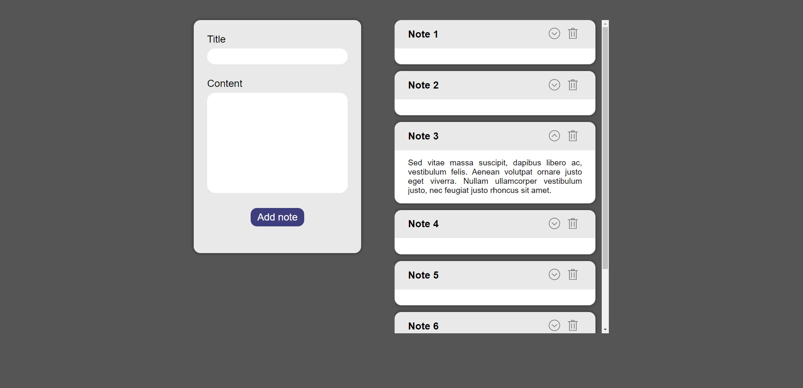

# Note App | React with firebase

Basic example of getting and sending data to the backend API (google firebase in that case) with help of fetch API and custom hooks.

## Table of contents

- [General info](#general-info)
- [Preview](#preview)
- [Technologies](#technologies)
- [Setup](#setup)

## General info

This project is nothing but dummy notes app - it has form, list, functionality of adding new items and deleting ones, that's all about.

But the key is, I've implemented whole backend communication. Data is no longer stored in localStorage or cookies, but on real (as far as we can call google firebase like that) database.

It sends multiple http request with Fetch API depends on what action should be performed: adding new notes with 'POST' method, deleting those with 'DELETE' and receiving list on every page opening/realoading with 'GET'. Moving whole requests logic into custom hook prevents from code repeatability, so DRY approval.

I also focused more on overall project structure, so I divided all files into accurate directories: assets, components, hooks, layout, utils and store (using context API was kinda overkill for this project though, but I wanted to expose as much skill as possible with that small project).

## Preview



## Technologies

More and less, project is created with:

- JavaScript ES6+ code standard
- React (hooks, custom hooks, context API)
- REST API
- Fetch API for http requests
- CSS modules

## Setup

To run this project, install it locally using npm or yarn:

```
$ npm install / yarn install
$ npm start / yarn start
```
